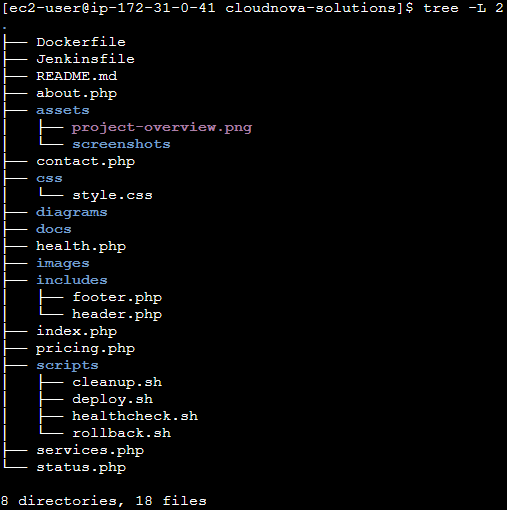

# ☁️ CloudNova Solutions

### Cloud & DevOps CI/CD Project using AWS, Docker, Jenkins & GitHub

A beginner-friendly end-to-end Cloud & DevOps project demonstrating Continuous Integration and Continuous Deployment (CI/CD) using **AWS EC2**, **Docker**, **Jenkins**, **GitHub**, and **PHP**.

---

---

## 📖 Project Overview

CloudNova Solutions is a fictional cloud consulting company developed as a hands-on Cloud & DevOps project.

The objective of this project was to deploy a PHP application on AWS EC2, containerize it using Docker, automate deployment using Jenkins, and manage the source code with GitHub.

This project demonstrates a complete CI/CD workflow while following industry-standard DevOps practices.

---

## 🚀 Project Highlights

- Dockerized PHP Application
- Jenkins CI/CD Pipeline
- AWS EC2 Deployment
- GitHub Integration
- Automated Container Deployment
- Health Check Endpoint
- Responsive Multi-Page Website
