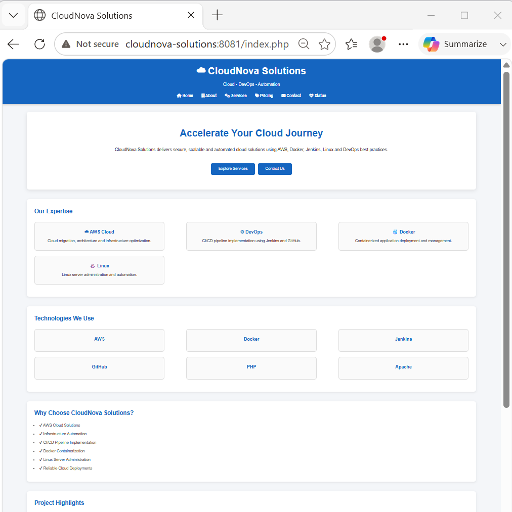
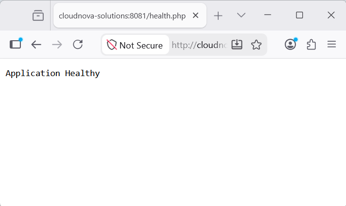
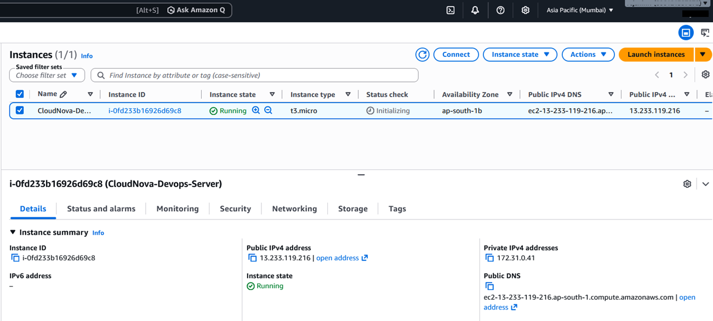
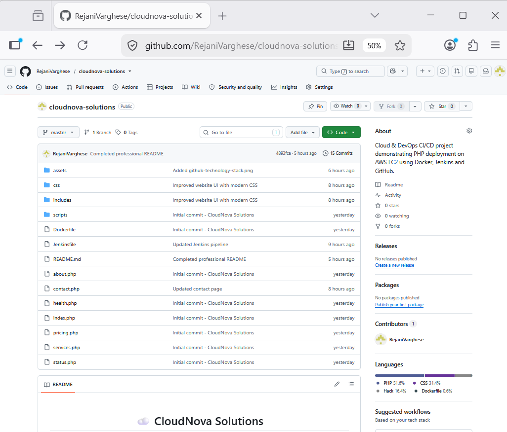
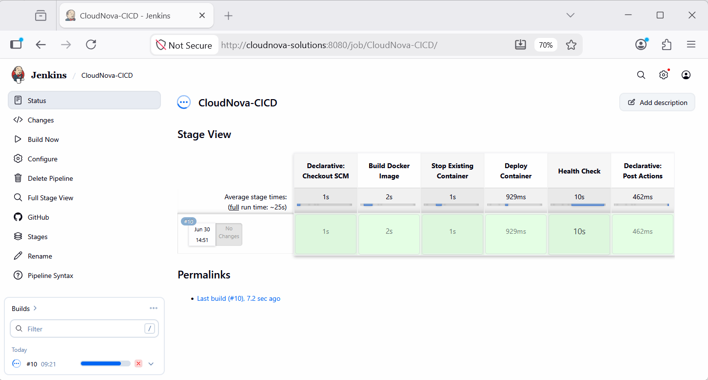
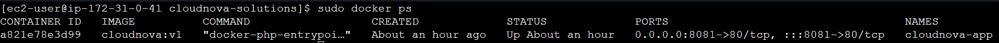

# ☁️ CloudNova Solutions

A complete Cloud & DevOps project demonstrating automated deployment of a PHP web application on AWS EC2 using Docker, Jenkins, Git, and GitHub.

---

# 📌 Project Overview

CloudNova Solutions is a multi-page PHP web application developed to demonstrate an end-to-end DevOps workflow.

The project showcases how a web application can be version-controlled using GitHub, containerized using Docker, deployed on AWS EC2, and automatically redeployed through a Jenkins CI/CD pipeline.

This project focuses on practical implementation of Cloud and DevOps concepts while following industry best practices.

---

# 🚀 Features

- Multi-page PHP website
- Responsive user interface
- Docker containerization
- Jenkins CI/CD pipeline
- Automated deployment
- AWS EC2 hosting
- Health Check page
- Application Status Dashboard
- Professional GitHub documentation

---

# 🛠 Technology Stack

| Technology | Purpose |
|------------|---------|
| Amazon Linux 2023 | Operating System |
| AWS EC2 | Cloud Hosting |
| PHP 8.2 | Backend |
| Apache HTTP Server | Web Server |
| Docker | Containerization |
| Jenkins | CI/CD Automation |
| Git | Version Control |
| GitHub | Source Code Repository |
| HTML5 | Web Structure |
| CSS3 | Styling |

---

# 📂 Project Structure

```text
cloudnova-solutions/

├── assets/
│   ├── project-overview.png
│   └── screenshots/
│
├── css/
│   └── style.css
│
├── docs/
│
├── diagrams/
│
├── includes/
│   ├── header.php
│   └── footer.php
│
├── scripts/
│
├── index.php
├── about.php
├── services.php
├── pricing.php
├── contact.php
├── status.php
├── health.php
│
├── Dockerfile
├── Jenkinsfile
├── README.md
├── CHANGELOG.md
├── LICENSE
├── .gitignore
└── .dockerignore
```

---

# 🏗 Solution Architecture


---

# ⚙️ CI/CD Workflow

```text
Developer
     │
     ▼
Git Commit
     │
     ▼
GitHub Repository
     │
     ▼
Jenkins Pipeline
     │
     ▼
Docker Image Build
     │
     ▼
Stop Existing Container
     │
     ▼
Deploy New Container
     │
     ▼
Health Check
     │
     ▼
Application Available on AWS EC2
```

---

# 📸 Project Screenshots

## 🏠 Home Page



---

## ❤️ Health Check



---

## ☁️ AWS EC2 Deployment



---

## 📂 GitHub Repository



---

## ⚙️ Jenkins Pipeline



---

## 🐳 Docker Container



---

# 🚀 Deployment Steps

1. Clone the repository

```bash
git clone https://github.com/<your-github-username>/cloudnova-solutions.git
```

2. Navigate to the project

```bash
cd cloudnova-solutions
```

3. Build the Docker image

```bash
docker build -t cloudnova:v1 .
```

4. Run the Docker container

```bash
docker run -d \
--name cloudnova-app \
-p 8081:80 \
cloudnova:v1
```

5. Open the application

```text
http://<EC2-PUBLIC-IP>:8081
```

---

# ❤️ Health Check

```text
http://<EC2-PUBLIC-IP>:8081/health.php
```

---

# 📊 Status Dashboard

```text
http://<EC2-PUBLIC-IP>:8081/status.php
```

---

# 💡 Challenges Faced

- Configuring Docker on AWS EC2
- Building a Jenkins CI/CD pipeline
- Managing Docker containers during deployment
- Troubleshooting Docker image build failures
- Configuring Health Check validation
- Organizing project documentation

---

# 📚 Key Learning Outcomes

- AWS EC2 instance management
- Docker image creation and container management
- Jenkins Pipeline development
- Git and GitHub workflow
- PHP application deployment
- CI/CD automation
- Linux server administration

---

# 🔮 Future Enhancements

- SSL/HTTPS support
- Custom domain integration
- Nginx reverse proxy
- GitHub Webhooks
- Docker Compose
- AWS Load Balancer
- Terraform deployment

---

# 👩‍💻 Author

**Rejani Mary Varghese**

Cloud & DevOps Engineer

- GitHub: https://github.com/<your-github-username>
- LinkedIn: https://www.linkedin.com/in/<your-linkedin-profile>

---

# 📄 License

This project is licensed under the MIT License.

See the LICENSE file for details.

---

# ⭐ Support

If you found this project helpful, consider giving it a ⭐ on GitHub.
